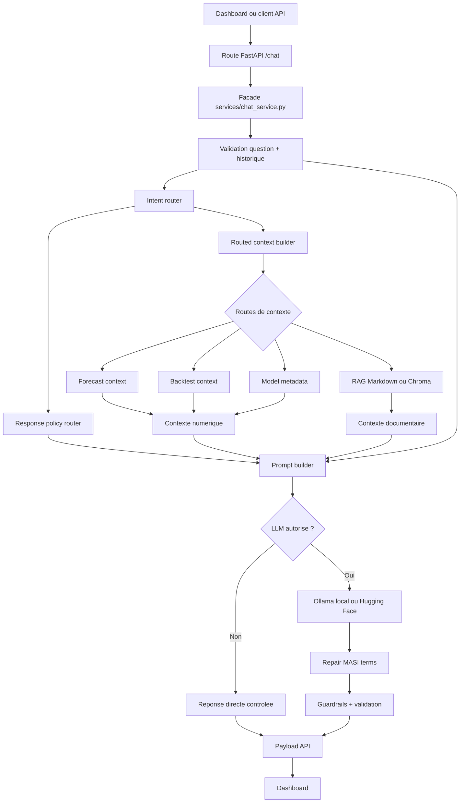

# Architecture detaillee du chatbot

Le chatbot est un assistant specialise MASI Risk Dashboard. Son role est d'expliquer les previsions, la VaR, l'Expected Shortfall, les regimes HMM, le backtesting et la strategie simulee, sans inventer de chiffres et sans produire de conseil d'investissement.

## Modules principaux

```text
backend/api/routes/chat.py
  Recoit les requetes HTTP et expose /chat, /chat/ask et /chat/ask/stream.

backend/services/chat_service.py
  Facade stable importee par les routes.

backend/chatbot/service.py
  Orchestrateur du tour de conversation.

backend/chatbot/intent_router.py
  Classe l'intention utilisateur.

backend/chatbot/routed_context_builder.py
  Selectionne les sources de contexte selon l'intention.

backend/chatbot/rag/
  Recupere le contexte documentaire fixe.

backend/dashboard_state/context_builder.py
  Lit les sorties numeriques du dashboard.

backend/chatbot/response_policy_router.py
  Definit les contraintes de reponse.

backend/chatbot/prompt_builder.py
  Assemble le prompt final.

backend/llm/local_ollama_client.py
  Appelle Ollama en local.

backend/chatbot/answer_repair.py
backend/chatbot/response_guardrails.py
  Corrigent et valident la reponse finale.
```

## Diagramme du flux

Pour une vue visuelle complete, voir aussi `CHATBOT_DIAGRAMS.md`. Une version LaTeX native, sans Markdown ni Mermaid, est disponible dans `CHATBOT_DIAGRAMS.tex`.



## Etapes d'un tour de chat

1. La route `chat.py` recoit une question, l'historique recent et parfois l'etat exact du dashboard.
2. `service.py` nettoie la question et tronque l'historique pour garder une memoire courte.
3. L'intention est classee par un routeur a embeddings legers: la question est encodee avec `sentence-transformers/all-MiniLM-L6-v2`, puis comparee aux centroïdes d'exemples annotés pour chaque intention. Un fallback lexical existe seulement si le modele local n'est pas disponible.
4. Une politique de reponse est construite. Elle peut interdire le LLM pour les demandes de conseil d'investissement.
5. Le contexte est route selon l'intention:
   - `forecast_query`: valeurs exactes des previsions.
   - `backtest_query` ou `strategy_query`: diagnostics statistiques/economiques.
   - `data_query` ou `model_query`: RAG documentaire et metadata modele.
   - `definition_query`: RAG documentaire.
6. `prompt_builder.py` assemble les instructions systeme, la politique, le contexte dashboard, le contexte numerique, le RAG et l'historique.
7. Le LLM local genere une reponse via Ollama, sauf si une reponse directe suffit.
8. La reponse est reparee puis filtree par les garde-fous.
9. L'API retourne la reponse, l'intention detectee, le backend LLM et les flags de contexte utilise.

## Routage d'intention

Le routage evite d'envoyer tout le contexte a chaque question. Une question sur la VaR n'a pas besoin des backtests complets, et une question sur Kupiec n'a pas besoin des previsions courantes.

Techniquement, le routeur d'intention n'appelle pas le LLM. Il utilise un modele d'embedding pre-entraine leger, le meme modele que le RAG vectoriel par defaut:

```text
sentence-transformers/all-MiniLM-L6-v2
```

Chaque intention possede plusieurs exemples annotés. Au demarrage, le systeme encode ces exemples et calcule un centroïde par intention. Pour une question utilisateur:

```text
question
  -> embedding local
  -> similarite cosinus avec chaque centroïde d'intention
  -> meilleure intention si le score depasse le seuil
  -> out_of_scope si confiance insuffisante
```

Cette approche est plus défendable qu'un simple keyword matching: elle reste locale, rapide et deterministe, mais capture mieux les reformulations naturelles.

Mapping simplifie:

```text
help_request      -> forecast + backtest
forecast_query    -> forecast
backtest_query    -> backtest
strategy_query    -> backtest
model_query       -> static_rag + model_metadata
data_query        -> static_rag + model_metadata
definition_query  -> static_rag
out_of_scope      -> aucun contexte
```

## RAG

Deux modes existent, avec `chroma` comme mode principal:

- `chroma`: mode vectoriel par defaut, avec embeddings Hugging Face et base Chroma locale.
- `markdown`: mode de secours rapide et deterministe, base sur les fichiers Markdown dans `backend/chatbot/rag/docs/`.

Le mode Chroma necessite une base vectorielle locale dans `backend/chatbot/rag/vector_db/`. Par defaut, les embeddings utilisent `sentence-transformers/all-MiniLM-L6-v2` sur CPU pour garder l'installation portable. Elle se reconstruit avec:

```powershell
cd app
..\.venv\Scripts\python.exe -m backend.chatbot.rag.build_index
```

Au demarrage, `WARM_RAG_ON_STARTUP=true` precharge le modele d'embedding et ouvre la base Chroma en arriere-plan. Cela augmente legerement le cout du startup, mais evite que la premiere question chatbot paie le cold start du retriever. Au runtime, `RAG_LOCAL_FILES_ONLY=true` force l'utilisation du cache local du modele d'embedding pour eviter un appel reseau pendant le warmup.

Le mode Markdown peut encore etre active explicitement pour du debug ou une demo legere:

```powershell
$env:RAG_RETRIEVER_BACKEND="markdown"
```

## Contexte dashboard prioritaire

Quand le frontend envoie `current_dashboard_state`, ce contexte est prioritaire. Il contient les valeurs visibles par l'utilisateur: horizon, date cible, rendement prevu, VaR, ES, volatilite, regime HMM, etc.

Le prompt precise de ne pas recopier ce contexte sous forme de dump et de ne pas inventer de nouveaux noms de metriques.

## Politiques et garde-fous

Le chatbot applique plusieurs protections:

- refus direct des conseils d'achat, vente ou allocation personnalisee;
- interdiction d'inventer des chiffres absents du contexte;
- rappel que la VaR est un seuil conditionnel de perte;
- rappel que l'ES est la perte moyenne au-dela du seuil VaR;
- rappel que le HMM represente un regime de volatilite, pas une direction de marche;
- validation finale contre hallucinations numeriques, confusion VaR/ES, certitude excessive et conseil financier.

## Streaming

`/chat/ask/stream` expose une reponse en `application/x-ndjson`. L'orchestrateur collecte les chunks LLM, applique les memes corrections/garde-fous, puis emet:

- un evenement `delta` contenant la reponse finale;
- un evenement `done` contenant les metadonnees du tour.

Cela garde le comportement coherent entre endpoint standard et endpoint streaming.
