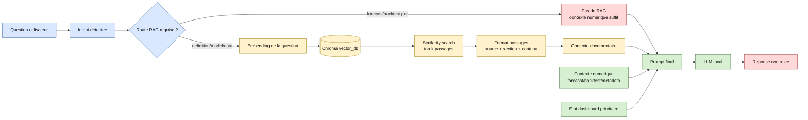
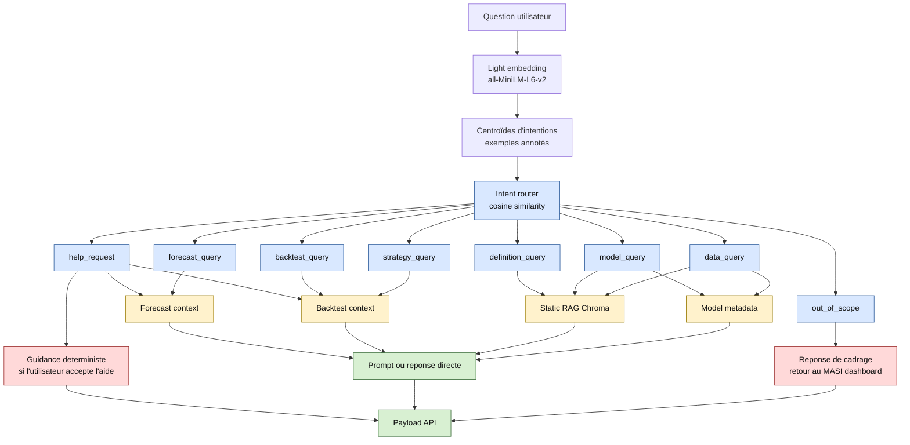
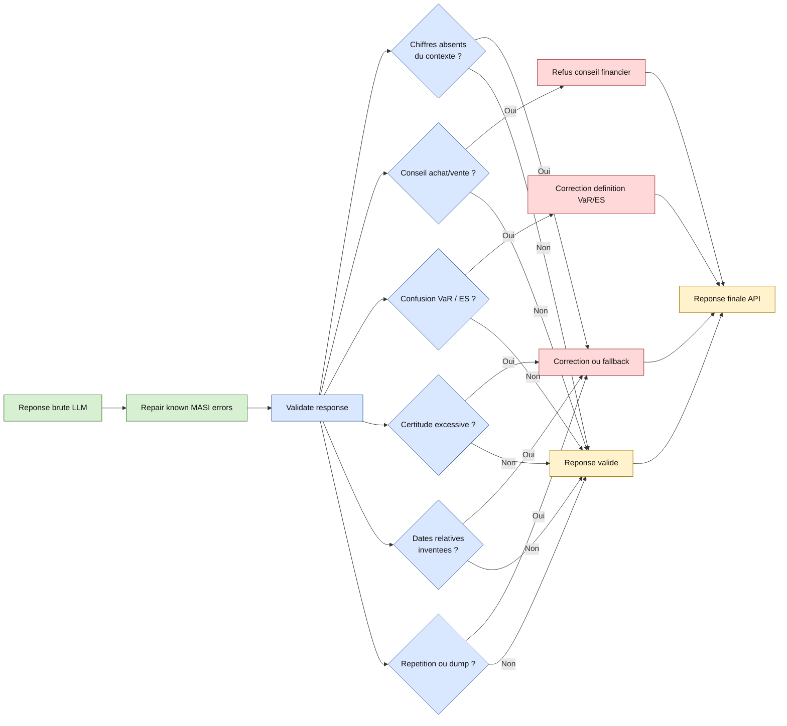
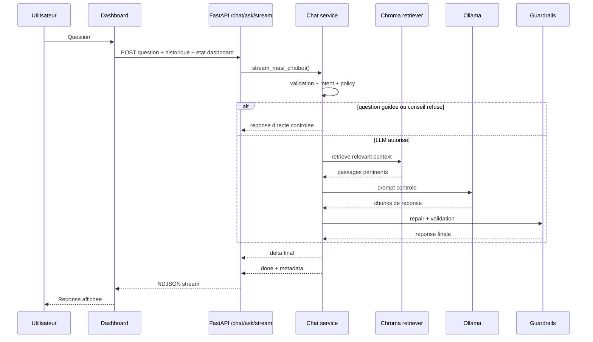

# Diagrammes du systeme chatbot

Ce document donne une vue visuelle complete du chatbot MASI Risk Engine: interface, API, orchestration, RAG vectoriel, contexte numerique, LLM local et garde-fous.

## 1. Vue globale du chatbot

```mermaid
flowchart LR
    User(["Utilisateur"]) --> UI["Dashboard web<br/>Chat panel"]
    UI --> API["FastAPI<br/>/chat/ask<br/>/chat/ask/stream"]
    API --> Service["Chat service<br/>orchestrateur"]

    Service --> Validate["Validation question<br/>historique recent"]
    Validate --> Intent["Embedding intent router<br/>centroid similarity<br/>help, forecast, backtest,<br/>definition, model, data"]
    Intent --> Policy["Response policy<br/>autorise ou bloque le LLM"]
    Intent --> Context["Routed context builder"]

    Context --> DashState["Etat exact du dashboard<br/>current_dashboard_state"]
    Context --> Numeric["Contexte numerique<br/>forecast, backtest, metadata"]
    Context --> RAG["RAG vectoriel Chroma<br/>documents techniques"]

    DashState --> Prompt["Prompt builder"]
    Numeric --> Prompt
    RAG --> Prompt
    Policy --> Prompt
    Validate --> Prompt

    Prompt --> Gate{"LLM autorise ?"}
    Gate -- "Non" --> Direct["Reponse directe controlee<br/>refus conseil financier<br/>guidance deterministe"]
    Gate -- "Oui" --> LLM["Ollama local<br/>qwen2.5:3b"]

    LLM --> Repair["Answer repair<br/>corrections MASI"]
    Repair --> Guardrails["Guardrails<br/>anti hallucination<br/>anti conseil<br/>VaR/ES"]
    Direct --> Payload["Payload API"]
    Guardrails --> Payload
    Payload --> UI

    classDef user fill:#f8f9fa,stroke:#222,stroke-width:1px,color:#111;
    classDef app fill:#d8f0d2,stroke:#3c6e3c,stroke-width:1px,color:#111;
    classDef control fill:#d9e8ff,stroke:#315f9e,stroke-width:1px,color:#111;
    classDef rag fill:#fff2cc,stroke:#997a00,stroke-width:1px,color:#111;
    classDef safety fill:#ffd9d9,stroke:#9e3131,stroke-width:1px,color:#111;

    class User user;
    class UI,API,Service,Prompt,Payload app;
    class Validate,Intent,Policy,Context,Gate control;
    class DashState,Numeric,RAG rag;
    class Direct,Repair,Guardrails safety;
```

## 2. Construction de la base RAG vectorielle

```mermaid
flowchart LR
    Docs["Documents Markdown<br/>backend/chatbot/rag/docs"] --> Clean["Nettoyage Markdown"]
    Clean --> SplitHeaders["Split par titres<br/>#, ##, ###"]
    SplitHeaders --> ChildChunks["Child chunks<br/>environ 200 tokens<br/>overlap 40"]
    ChildChunks --> Refine["Refine chunks longs<br/>Recursive splitter"]
    Refine --> Embed["Embedding model<br/>sentence-transformers/all-MiniLM-L6-v2"]
    Embed --> Vectors["Vecteurs normalises"]
    Vectors --> Chroma[("Chroma DB locale<br/>backend/chatbot/rag/vector_db")]

    BuildCmd["Commande<br/>python -m backend.chatbot.rag.build_index"] --> Docs

    classDef source fill:#f8f9fa,stroke:#222,color:#111;
    classDef process fill:#d8f0d2,stroke:#3c6e3c,color:#111;
    classDef vector fill:#d9e8ff,stroke:#315f9e,color:#111;
    classDef db fill:#fff2cc,stroke:#997a00,color:#111;

    class BuildCmd,Docs source;
    class Clean,SplitHeaders,ChildChunks,Refine process;
    class Embed,Vectors vector;
    class Chroma db;
```

## 3. Retrieval RAG pendant une question

## 4. Routage du contexte par intention

## 5. Garde-fous et validation finale

## 6. Sequence API streaming

