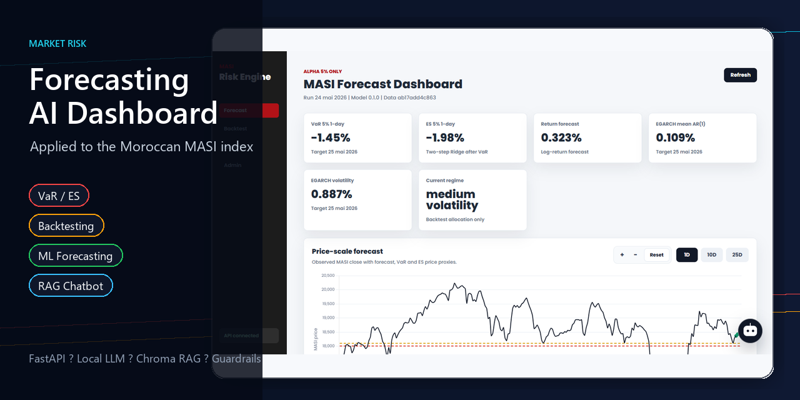

# Market Risk Forecasting AI Dashboard

End-to-end market risk forecasting and AI-assisted risk analysis platform, applied to the Moroccan MASI stock index.



## What This Documentation Covers

This documentation explains the public architecture of the project:

- the FastAPI application and dashboard structure;
- the ML forecasting and backtesting workflow;
- the trained artifact and runtime data organization;
- the chatbot architecture;
- the vector RAG retrieval pipeline;
- the response policies and guardrails used by the AI assistant.

## Project Layers

```text
Research validation
  -> ML pipelines
  -> FastAPI services
  -> Dashboard
  -> Local RAG chatbot
  -> Guarded risk interpretation
```

## Main Repositories

- Application repository: [market-risk-forecasting-ai-dashboard](https://github.com/mohamedzayd-elfahime/market-risk-forecasting-ai-dashboard)
- Research notebooks: [masi-risk-research-notebooks](https://github.com/mohamedzayd-elfahime/masi-risk-research-notebooks)
- Chatbot reference implementation: [market-risk-rag-chatbot](https://github.com/mohamedzayd-elfahime/market-risk-rag-chatbot)

## Local Application

The application can be launched locally with FastAPI after installing the project dependencies and rebuilding the local vector RAG index.

```powershell
cd app
..\.venv\Scripts\python.exe -m backend.chatbot.rag.build_index
..\.venv\Scripts\python.exe -m uvicorn backend.main:app --reload --host 127.0.0.1 --port 8000
```

The dashboard is then available at:

```text
http://127.0.0.1:8000/
```

## Disclaimer

This project is for research, education, and risk interpretation. It does not provide financial advice.
